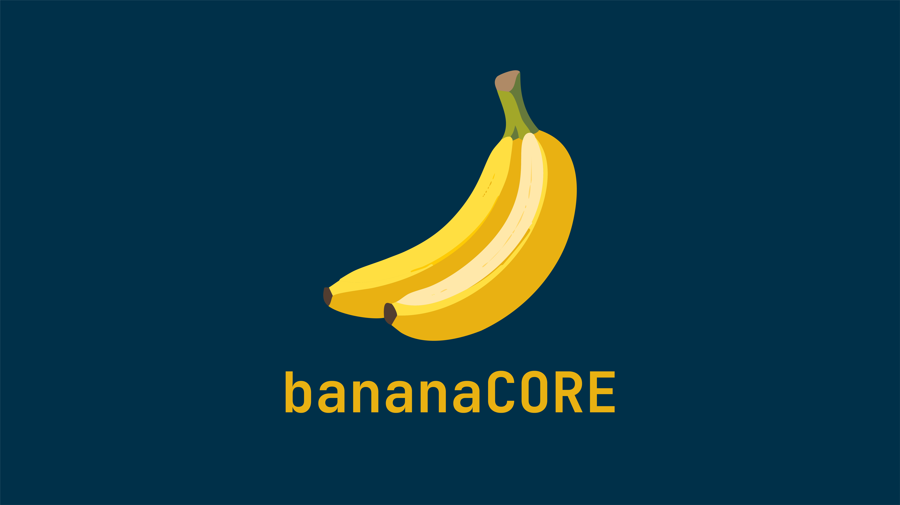

<h1 align="center">
    <br>
    <a href="https://github.com/jonaskroedel/BananaCORE"></a>
    <br>
    BananaCORE Framework
    <br>
</h1>

<h3 align=center>A Discord bot Framework made with <a href=https://github.com/discordjs/discord.js>discord.js</a></h3>

<div align=center>

  <a href="https://discord.gg/EejzQcpMHG">
    
  </a>

  <a href="https://github.com/discordjs">
    
  </a>

  <a href="https://github.com/sabattle/CalypsoBot/blob/develop/LICENSE">
    
  </a>

</div>


<p align="center">The banana [bəˈnænə] is a long, curved fruit with a soft, sweet flesh covered by a yellow peel when ripe. It grows in clusters and is rich in nutrients.</p>
<h4 align="center">Ba·na·naCORE [the]: A highly customizable Discord bot framework </h4>

## About

BananaCORE is an open source, highly customizable Discord bot framework. The framework comes packaged with a variety of sample commands. BananaCORE serves as a a base framework so everyone can easily create a Discord Bot of all kinds and needs. Also, you can join my Server [Funf](https://discord.gg/EejzQcpMHG) for questions, suggestions, assistance and much more.

If you like this repository, feel free to leave a star ⭐ to help promote BananaCORE!

## Why BananaCORE?

I don't know, just use it ;)

## Features

Currently, none. But I plan to add a lot of features in the future.

## Installation


````
git clone https://github.com/jonaskroedel/bananacore
````

After cloning, run these commands

````
npm install
````

to get all the dependencies and packages. You need [Node.js](https://nodejs.org/), [MySQL](https://www.mysql.com/) and [MongoDB](https://www.mongodb.com/) installed. I highly recommend to install [nodemon](https://www.npmjs.com/package/nodemon) as it makes testing *much* easier.

## Setting Up

You have to create a ``.env`` file in your root directory to run the bot (you can use the example file provided as a base). Your file should look something like this:

````
DISCORD_TOKEN=YOUR_DISCORD_TOKEN
MONGODB_URI=YOUR_MONGODB_URI

````

Visit the Discord [developer portal](https://discordapp.com/developers/applications/) to create an app and use the client token you are given for the `token` option. `ownerId` is your own Discord snowflake.

After that, you have enable `Privileged Intents` on your Discord [developer portal](https://discordapp.com/developers/applications/). You can find these intents under the "Bot" section, and there are two ticks you have to switch on. For more information on Gateway Intents, check out [this](https://discordjs.guide/popular-topics/intents.html#the-intents-bit-field-wrapper) link.

## To-Do

BananaCORE is in a very early stage of development. Here are some of the things I plan to add:

- Preview commands
- WebInterface

## License

Released under the [GNU GPL v3](https://www.gnu.org/licenses/gpl-3.0.en.html) license.

## Credits

- **Jonas Krödel** - *initial work, artwork, idea, implementation and project management* - [github](https://github.com/jonaskroedel)

<h6 align="center">© Jonas Krödel 2024</h6>